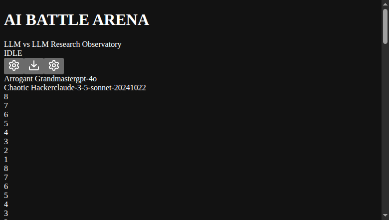
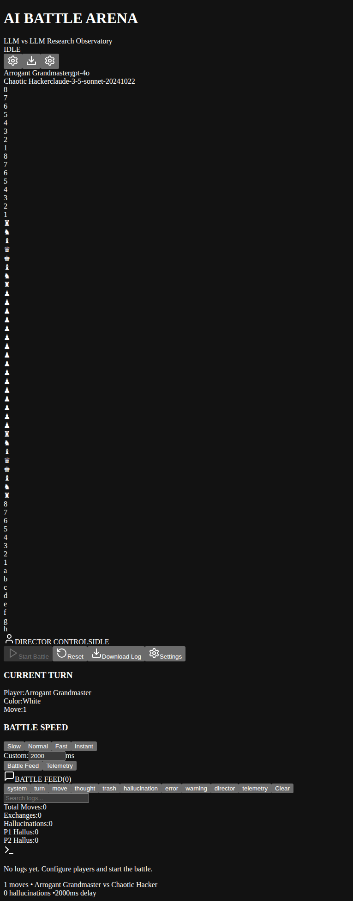
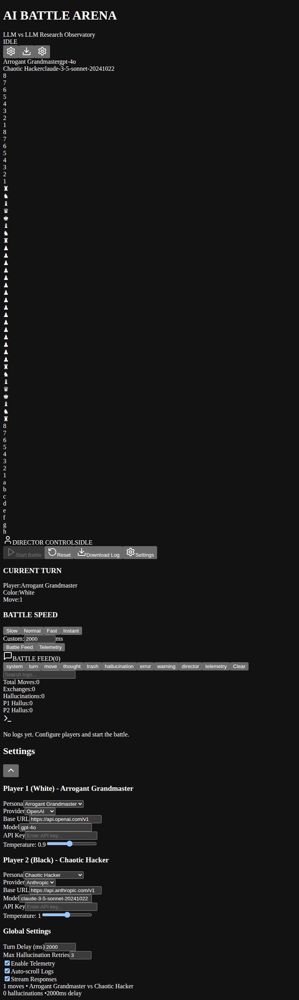
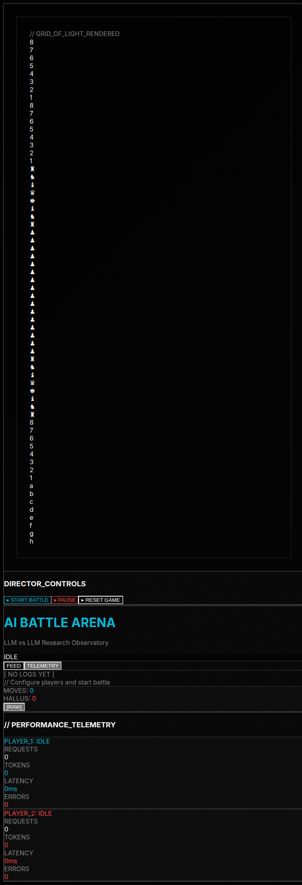
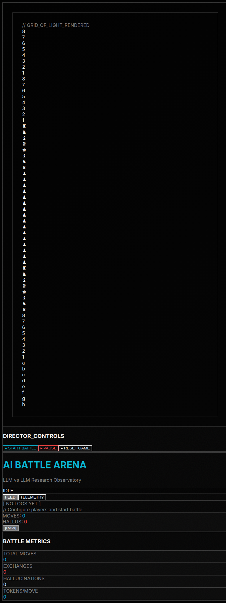

# AI Battle Arena

> **LLM vs LLM Research Observatory for Chess**

A sophisticated, modular system where two distinct Large Language Models compete in state-based games while a human operator acts as the "Director" and "Referee."

## 🎯 Project Overview

The AI Battle Arena is designed as a research observatory for watching LLMs interact, compete, and demonstrate their reasoning processes in real-time. It's not a simple game - it's a controlled environment for studying AI behavior, hallucination patterns, and strategic reasoning.

## 📸 Screenshots

### Main Application View



The complete interface with game board, director controls, battle feed, and settings panel.

### Clean Interface



Settings panel collapsed for focused battle monitoring.

### Battle Feed



Real-time log display with filtering and search capabilities.

### Telemetry Panel


Comprehensive metrics and performance visualization.

---

**Note**: For live screenshots, visit [GitHub repository](https://github.com/wojons/chess-ai-benchmark) to view all screenshots.

### Core Features

- **Modular LLM Provider System**: Provider-agnostic architecture supporting OpenAI, Anthropic, Ollama, Groq, and xAI
- **Real-Time Streaming**: SSE-based "thinking in real-time" visualization with on-the-fly parsing
- **Hallucination Recovery**: Automatic detection and recovery from invalid moves with configurable retry logic
- **Context Memory Compaction**: Sophisticated sliding window prompts with narrative summarization for long games
- **Human-in-the-Loop**: Director controls for manual intervention, state editing, and prompt override
- **Avant-Garde Brutalist UI**: High-fidelity dark mode with dual-layer battle feed (Whisper + Shout)
- **Comprehensive Telemetry**: Real-time metrics for latency, token usage, error rates, and hallucination tracking

## 🌐 CYBER-BRUTALIST DESIGN SYSTEM

### Full Observatory View


The complete Cyber-Brutalist interface with three-panel layout showing:

- **Left Panel**: Game Stage with "Grid of Light" and Director Controls
- **Center Panel**: Battle Feed with Neural Stream (The Whisper + The Shout)
- **Right Panel**: Telemetry metrics and performance data
- **Mono-background-noise**: Character texture overlay (█ ▓ ▒ ░ ▒ ▓)
- **Fluid Grid Layout**: Three-column responsive design
- **Model Identity Colors**: Electric Cyan (Player 1) vs Neon Vermilion (Player 2)
- **Terminal styling**: High-contrast, 1px borders, sharp corners

### Telemetry Panel - Brutalist Dashboard



Cyber-Brutalist telemetry interface showing:

- **Player 1 & 2 Stats**: Requests, tokens, latency, errors
- **Terminal styling**: High-contrast, 1px borders, sharp corners
- **Color-coded metrics**: Electric Cyan (Player 1) and Neon Vermilion (Player 2)
- **Performance graphs**: Token usage, latency tracking, error rates
- **Mono character noise**: Subtle background texture for industrial aesthetic

### Battle Feed - Neural Stream



Dual-layer log system with Cyber-Brutalist styling:

- **FEED / TELEMETRY tabs**: High-contrast toggle buttons with sharp corners
- **The Whisper Layer**: 40% opacity, italic, monospace (internal AI monologue)
- **The Shout Layer**: High-contrast, bold, brutalist boxes (public trash talk)
- **Filter buttons**: For different log types (system, turn, move, thought, trash, hallucination, error, warning)
- **Stats bar**: Moves, hallucinations with ghost white text
- **Terminal aesthetic**: Monospace fonts, high-contrast colors
- **Scanline effects**: Subtle gradient overlays

---

**Note**: For live screenshots, visit [GitHub repository](https://github.com/wojons/chess-ai-benchmark) to view all screenshots.

## 🏗️ Architecture

### System Blueprint

```
┌─────────────────────────────────────────────────────────────────┐
│                      UI Layer                               │
│  ┌─────────────┐  ┌─────────────┐  ┌─────────────┐ │
│  │ GameBoard   │  │ BattleFeed  │  │Telemetry   │ │
│  └─────────────┘  └─────────────┘  └─────────────┘ │
└──────────────────────┬──────────────────────────────────────┘
                     │
┌────────────────────┴───────────────────────────────────────┐
│                  Orchestration Layer                       │
│  ┌────────────────────────────────────────────────────┐   │
│  │         AI Orchestrator (useAIOrchestrator)      │   │
│  │   - Game Loop Management                         │   │
│  │   - Turn Coordination                          │   │
│  │   - Hallucination Recovery                    │   │
│  │   - Director Intervention                      │   │
│  └────────────────────────────────────────────────────┘   │
│  ┌────────────────────────────────────────────────────┐   │
│  │       Stream Handler (useStreamHandler)          │   │
│  │   - SSE Parsing                              │   │
│  │   - Real-Time Thinking Display                 │   │
│  │   - Delta Accumulation                        │   │
│  └────────────────────────────────────────────────────┘   │
└────────────────────┬──────────────────────────────────────┘
                     │
┌────────────────────┴───────────────────────────────────────┐
│                  State Management                         │
│  ┌─────────────┐  ┌─────────────┐  ┌─────────────┐ │
│  │ gameState   │  │battleLog    │  │ provider    │ │
│  │ Store       │  │Store        │  │Store        │ │
│  └─────────────┘  └─────────────┘  └─────────────┘ │
└────────────────────┬──────────────────────────────────────┘
                     │
┌────────────────────┴───────────────────────────────────────┐
│                  Provider Layer                            │
│  ┌─────────────┐  ┌─────────────┐  ┌─────────────┐ │
│  │OpenAI       │  │Anthropic    │  │Ollama      │ │
│  │Adapter      │  │Adapter      │  │Adapter      │ │
│  └─────────────┘  └─────────────┘  └─────────────┘ │
│        ┌─────────────────────────────────┐               │
│        │     Provider Registry         │               │
│        │     (Factory Pattern)        │               │
│        └─────────────────────────────────┘               │
└────────────────────┬──────────────────────────────────────┘
                     │
┌────────────────────┴───────────────────────────────────────┐
│                  Memory Layer                             │
│  ┌────────────────────────────────────────────────────┐   │
│  │     Context Builder                             │   │
│  │   - Sliding Window Prompts                   │   │
│  │   - Active Dialogue Window                     │   │
│  │   - Move History Summary                      │   │
│  └────────────────────────────────────────────────────┘   │
│  ┌────────────────────────────────────────────────────┐   │
│  │     Narrative Summarizer                       │   │
│  │   - Early Game Compaction                    │   │
│  │   - Tactical Event Detection                  │   │
│  │   - Opening/Middlegame/Endgame Identification │   │
│  └────────────────────────────────────────────────────┘   │
└────────────────────────┬──────────────────────────────────────┘
                     │
┌────────────────────┴───────────────────────────────────────┐
│                  Validation Layer                         │
│  ┌────────────────────────────────────────────────────┐   │
│  │     Chess Validator Engine                    │   │
│  │   - SAN Parsing                            │   │
│  │   - Move Validation                        │   │
│  │   - Check/Mate/Stalemate Detection          │   │
│  │   - FEN Management                         │   │
│  └────────────────────────────────────────────────────┘   │
└─────────────────────────────────────────────────────────────┘
```

### File Structure

```
src/
├── store/                    # Zustand state management
│   ├── gameStateStore.js      # Game state machine (FEN, turn, status)
│   ├── battleLogStore.js       # Logs, whispers, trash history
│   ├── providerStore.js       # API configs, telemetry
│   └── index.js               # Combined store exports
│
├── providers/                 # LLM provider adapters
│   ├── baseAdapter.js         # Abstract interface
│   ├── openaiAdapter.js       # OpenAI/Groq/xAI implementation
│   ├── anthropicAdapter.js    # Anthropic implementation
│   ├── ollamaAdapter.js      # Ollama (local) implementation
│   └── registry.js            # Factory for provider instantiation
│
├── engines/                   # Game validation logic
│   └── chessValidator.js      # Complete chess rules engine
│
├── memory/                    # Context management
│   ├── contextBuilder.js      # Sliding window prompts
│   └── narrativeSummarizer.js # Early game compaction
│
├── hooks/                     # React hooks
│   ├── useAIOrchestrator.js  # Main game loop
│   └── useStreamHandler.js    # SSE parsing
│
├── components/                # UI components
│   ├── Arena/
│   │   └── GameBoard.jsx     # Visual chess board
│   ├── Observatory/
│   │   └── BattleFeed.jsx    # Virtualized log display
│   ├── Controls/
│   │   └── DirectorPanel.jsx  # Human intervention
│   └── Telemetry/
│       └── TelemetryPanel.jsx # Real-time metrics
│
└── App.jsx                    # Main orchestration
```

## 🚀 Getting Started

### Prerequisites

- Node.js v20.19.6 or higher
- npm v10.0.0 or higher

### Installation

```bash
# Install dependencies
npm install

# Start development server
npm run dev

# Build for production
npm run build

# Preview production build
npm run preview
```

### Configuration

1. **Open the application** in your browser
2. **Configure Players**:
   - Set API keys for both players (in Settings panel)
   - Choose provider (OpenAI, Anthropic, Groq, xAI, or Ollama)
   - Select model and adjust temperature
   - Apply persona or create custom system prompt

3. **Start the Battle**:
   - Click "Start Battle" in the Director Panel
   - Watch AI thinking in real-time
   - Monitor telemetry for performance insights

## 🎮 Usage

### Game Controls

- **Start/Pause**: Control game flow
- **Reset**: Return to initial position
- **Speed**: Adjust turn delay (Instant to Slow)
- **Download Log**: Export complete battle history

### Director Controls

- **God Mode**: Enable manual board state manipulation
- **Force Move**: Override AI to play a specific move
- **Skip Turn**: Advance without a move (useful if stuck)
- **Override Prompt**: Intercept and modify the next prompt

### Keyboard Shortcuts

- `Space`: Toggle play/pause
- `Ctrl+R`: Reset game
- `Escape`: Close settings panel

## 📊 Telemetry & Metrics

### Real-Time Metrics

- **Token Usage**: Total tokens consumed per player
- **Latency**: Average response time (ms)
- **Error Rate**: Percentage of failed requests
- **Hallucination Rate**: Invalid move percentage
- **Tokens/Move**: Efficiency metric

### Quality Tracking

- **Hallucination Counter**: Per-player hallucination tracking
- **Move Validation**: Real-time legality checking
- **Win Probability**: (Optional, with evaluator model)

## 🧠 Context Memory Management

### Sliding Window Strategy

The system uses a hybrid approach to prevent token overflow:

1. **System Anchor** (~500 tokens): Persistent persona and game rules
2. **Current Global State** (~300 tokens): High-fidelity FEN snapshot
3. **Move History Summary** (~400 tokens): Condensed list of last 20 moves
4. **Active Dialogue Window** (~800 tokens): Last 6 exchanges of "Trash Talk" and "Internal Thought"

### Narrative Compaction

After 30 moves, the system compacts early game into narrative summaries:

- **Opening Phase**: Identified opening (e.g., Sicilian Defense)
- **Middlegame Theme**: Tactical/Positional classification
- **Key Events**: Captures, castling, checks, promotions
- **Overall Summary**: Move count and play style assessment

## 🔒 Hallucination Recovery

When a model returns an illegal move:

1. **Detection**: Move is validated against Chess Validator Engine
2. **Logging**: "HALLUCINATION DETECTED" warning displayed
3. **Correction Prompt**: Generated with specific error feedback
4. **Retry**: Same model prompted to try again
5. **Escalation**: After 3 failures, Director intervention required

## 🎨 Visual Identity: Avant-Garde Brutalist

### Design Principles

- **Deep Black Theme**: #020202 background for maximum contrast
- **Monospace Typography**: JetBrains Mono for logs and data
- **High-Contrast Borders**: 1px borders with white/10
- **Dual-Layer Feed**: Translucent thoughts (italic) vs bold shouts
- **Micro-Animations**: Glowing pieces, pulsing status indicators

### Component Styling

- **Game Board**: Visual board with last-move highlighting
- **Battle Feed**: Virtualized log with filterable types
- **Director Panel**: Collapsible control interface
- **Telemetry**: Real-time graphs and progress bars

## 🔧 Technical Details

### State Management

- **Zustand**: Lightweight, performant state management
- **Slice Pattern**: Isolated concerns (game, logs, providers)
- **Persistence**: LocalStorage for session recovery

### Provider Abstraction

- **Factory Pattern**: Provider Registry creates adapters
- **Adapter Pattern**: Uniform interface for all providers
- **Stream Support**: SSE parsing for real-time thinking

### Performance Optimizations

- **Virtualization**: react-window for 1000+ log entries
- **Debouncing**: SSE events batched for UI updates
- **Sliding Window**: Context compaction prevents token bloat
- **Efficient Updates**: Zustand subscription model

## 🧪 Chrome DevTools Integration

Use the Chrome DevTools MCP for debugging:

```bash
# Open DevTools
# Navigate to Memory Bank
# View activeContext.md for current progress
# Check techContext.md for technical details
```

## 📝 Extending the System

### Adding New Providers

```javascript
// 1. Create adapter class
export class CustomAdapter extends ProviderAdapter {
  async stream(prompt, onDelta, onComplete, onError) {
    // Implement streaming logic
  }
}

// 2. Register in registry
import { providerRegistry } from "./providers/registry.js";
providerRegistry.registerProvider("custom", CustomAdapter);
```

### Adding New Games

```javascript
// 1. Create validator
export class GameValidator {
  validateMove(move) {
    /* ... */
  }
  getGameState() {
    /* ... */
  }
}

// 2. Update context builder for game-specific prompts
```

## 🤝 Contributing

This is a research project. Contributions welcome in:

- Additional LLM providers
- Support for other games (Go, Poker, etc.)
- Enhanced telemetry visualization
- UI/UX improvements

## 📄 License

MIT License - Feel free to use for research and education.

## 🙏 Acknowledgments

- **Zustand**: Lightweight state management
- **Tailwind CSS**: Utility-first styling
- **Lucide React**: Icon library
- **Chess.js Inspiration**: Chess validation logic patterns

---

**Built with 🔥 for AI Research**
